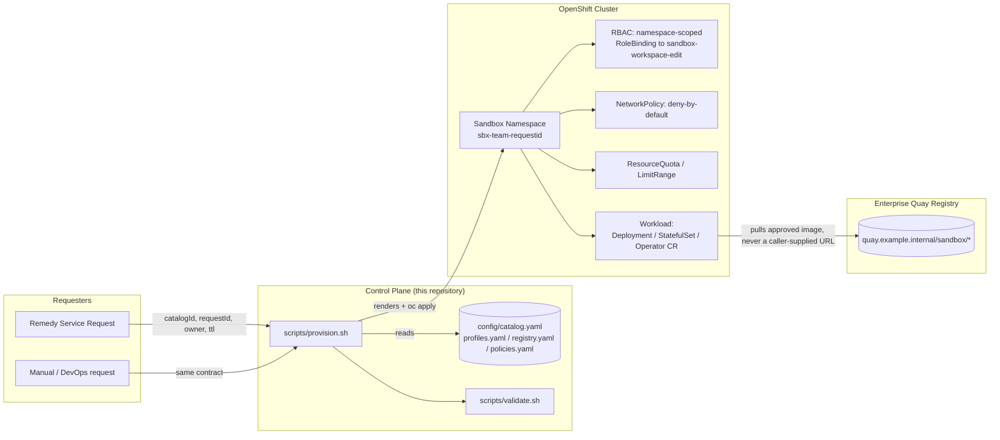

# Architecture

## Overview

The Enterprise Sandbox Catalog turns a small, Remedy-facing request
(Catalog ID + a handful of policy-bounded parameters) into an isolated,
governed OpenShift namespace running an approved workload -- never an
arbitrary container image.



## Control Plane

The control plane is entirely declarative and lives in this Git
repository: `config/catalog.yaml` (what can be provisioned),
`config/profiles.yaml` (how big), `config/registry.yaml` (where images come
from), and `config/policies.yaml` (governance rules as machine-readable
settings). `scripts/provision.sh` is the only code path that turns a
request into cluster resources; it never embeds catalog knowledge itself
-- every decision it makes traces back to one of those four files.

`scripts/deploy.sh` installs the one cluster-scoped piece the control
plane needs (`base/rbac/cluster-role.yaml`, a namespace-scoped-only
ClusterRole) and mirrors `config/*.yaml` into a control-plane namespace
(`sandbox-system` by default) as ConfigMaps, so other tooling (Ansible, a
future HTTP API) can read the same source of truth from inside the
cluster if that becomes more convenient than reading this Git repository
directly.

## Runtime Plane

Each provisioning request produces exactly one isolated namespace,
named `sbx-<team>-<requestId>` (Section 12), carrying:

- **Labels** identifying the Catalog ID, request ID, environment, and
  that it is managed by this automation (`sandbox.gosi/managed-by:
  sandbox-automation` -- the load-bearing label `scripts/delete-sandbox.sh`
  checks before deleting anything).
- **Annotations** for owner, creation timestamp, expiry timestamp, and the
  originating Remedy request ID (never anything sensitive -- Section 12).
- **RBAC**: a `RoleBinding` scoped to that namespace, binding the
  cluster-scoped `sandbox-workspace-edit` ClusterRole to the requesting
  owner -- never `cluster-admin`, never a `ClusterRoleBinding`.
- **NetworkPolicy**: deny-by-default, with narrow, explicit exceptions
  (same-namespace, DNS, and -- only if the catalog entry exposes a Route --
  ingress from the OpenShift router). See `docs/SECURITY.md`.
- **ResourceQuota / LimitRange**: enterprise defaults from
  `config/policies.yaml`, protecting against unbounded Pods/PVCs/CPU/RAM.
- **The workload itself**, shaped by the Catalog ID's `type` (Section 3 /
  `docs/CATALOG-MAPPING.md`): a Workspace Deployment, a Stateless Service
  Deployment, a Platform Service StatefulSet, an operator/Helm placeholder
  awaiting an enterprise decision, or a platform-integration component with
  no standalone workload at all.

Every namespace is independent and disposable: deleting it (via
`scripts/delete-sandbox.sh`, after its managed-by/request-id labels are
verified) removes everything created for that request.

### Why envsubst templates instead of per-request Kustomize overlays

Kustomize overlays are a natural fit when you have a small, fixed set of
long-lived environment variants (dev/stage/prod). Here, every unit of
deployment is a *request* -- ephemeral, one-off, and parameterized by
values (namespace, owner, TTL, image tag) that are only known at
provisioning time, not at Git-authoring time. Modeling ~49 Catalog IDs x
N concurrent requests as static, checked-in overlay directories would mean
generating and discarding a Kustomize overlay per request, which adds
machinery without adding safety. Instead:

- **`templates/*/base`** hold the reusable, parameterized manifest shapes
  (Section 20's "reusable base templates").
- **`config/catalog.yaml`** holds the per-Catalog-ID differences (Section
  20's "central catalog metadata").
- **`scripts/provision.sh`** resolves a specific request into a specific
  set of rendered manifests via `envsubst`, and applies them with
  `oc apply` (idempotent, converges on re-run -- Section 14).
- **`catalog/<domain>/<id>/`** directories hold genuine, structural
  overrides -- the operator/Helm placeholders and the one documented
  cross-service dependency (`INT-KCONNECT` -> `INT-KAFKA`) -- exactly the
  cases Section 20 calls out as needing something other than templating.

`oc kustomize`/Kustomize is still a fine tool for the DevOps team's own
GitOps pipeline if they choose to check in a *rendered* manifest for a
long-lived, non-ephemeral service; it just isn't the mechanism this
repository uses for per-request rendering.

## Image Supply Chain

```
approved upstream/base image
        │
        ▼
enterprise rebuild (against BASE-UBI9 / BASE-UBI9M, non-root, pinned)
        │
        ▼
vulnerability + malware/policy scan  (Governance: "Scan")
        │
        ▼
owner + Security approval
        │
        ▼
publish to Quay: quay.example.internal/sandbox/<path>:<version-tag>
        │
        ▼
digest resolution: quay.example.internal/sandbox/<path>@sha256:...
        │
        ▼
config/catalog.yaml image.digest updated -> catalog publication
```

Today, `config/catalog.yaml` deploys every direct-image Catalog ID by the
floating `:approved` tag (`config/registry.yaml` `registry.defaultTag`).
`scripts/provision.sh::resolve_image_ref()` already prefers `image.digest`
over `image.tag` whenever a digest is present, and
`config/policies.yaml` `images.requireDigestInProduction` is the single
switch that, once flipped, makes digest pinning mandatory. See
`config/registry.yaml` "Image promotion process" for the full pipeline
this describes.

## Service Catalog (Remedy exposure)

Remedy is expected to render its service catalog directly from
`config/catalog.yaml` (or the `Remedy Catalog View` sheet it was derived
from), filtered to `remedySelectable: true`. A Catalog ID with
`remedySelectable: false` (the three `BASE-*` images) can still be
provisioned directly by DevOps via `scripts/provision.sh`, but is never
shown to end users through Remedy.

## Governance: Auto vs Review

`config/catalog.yaml` `approval` mirrors the workbook's `Approval` column:

- **`auto`**: `scripts/provision.sh` proceeds once ordinary request
  validation passes (Catalog ID known, quotas/storage/GPU within policy).
- **`review`**: provisioning additionally requires `--approved true`. This
  flag is a *plumbing* mechanism, not a *security* control -- see
  `docs/SECURITY.md` "Approval trust boundary" for what a production
  integration must do instead (verify the caller's identity/workflow token
  server-side).

## Isolation model

Defense in depth, all namespace-scoped (never cluster-wide):

1. **Namespace** -- one per request, never shared.
2. **RBAC** -- `RoleBinding` to a namespace-scoped ClusterRole; no
   `cluster-admin`, ever (Governance, and explicitly for `OPS-OC`).
3. **NetworkPolicy** -- deny-by-default; DNS, same-namespace, and (only if
   a Route exists) router ingress are the only standing exceptions;
   controlled egress is opt-in and empty until the Network team supplies
   real CIDRs (fail-closed).
4. **ResourceQuota / LimitRange** -- bounds Pods, PVCs, Services, and
   aggregate CPU/RAM per namespace, independent of any single container's
   profile.
5. **Secrets isolation** -- no credential is ever generated, stored, or
   passed through this repository or its scripts; Secrets are pre-created
   out-of-band and only referenced by name (`templates/integration/secrets`).
