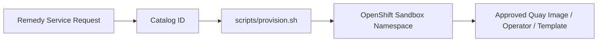

# Runbook

Operational handoff document for the OpenShift/DevOps team. Read
`docs/ARCHITECTURE.md` and `docs/SECURITY.md` first for the design
rationale this runbook assumes.

## Purpose

The Enterprise Sandbox Catalog lets requesters -- through BMC Remedy's
service catalog, or a DevOps engineer working directly -- provision a
governed, isolated OpenShift namespace by naming a **Catalog ID** only.
It never accepts an arbitrary container image, and every workload
ultimately runs from an image built and scanned through the enterprise
Quay pipeline, or a template/operator selected by the Infra/DevOps team.



See `docs/ARCHITECTURE.md` for the full diagram and control-plane/runtime-
plane breakdown.

## Prerequisites

**Cluster-side (Infra, one-time per cluster):**

| Requirement | Notes |
|---|---|
| OpenShift 4.x cluster access with permission to create ClusterRoles and Namespaces | Needed once, to run `scripts/deploy.sh` |
| A default StorageClass, or a named one to set in `config/policies.yaml` `storage.defaultClass` | See "Configuration" |
| OpenShift Router / default ingress domain configured | Needed for any Catalog ID with `network.route.enabled: true` (e.g. `DATA-JUP`, `WEB-NGINX`, `WEB-FRONT`) |
| A trusted wildcard TLS setup for Routes (or acceptance of the OpenShift-generated router CA) | Section 18 -- `edge` termination, redirect enforced |
| Internal Quay registry reachable from the cluster, with a pull secret/robot account strategy decided | `config/registry.yaml` -- **IMPLEMENTATION_REQUIRED** hostname + robot account decision |
| GPU Operator / device plugin installed, if any GPU-capable Catalog ID (`AI-PY`, `AI-PT`, `AI-TF`, `AI-HF`, `DATA-JUP`) will be used with `--gpu true` | `config/policies.yaml` `gpu.resourceName` must match the installed accelerator |
| Security sign-off on `restricted-v2` SCC compatibility for every published image | `docs/SECURITY.md` |
| Operator/Helm chart selections for Platform Service Catalog IDs marked `IMPLEMENTATION_REQUIRED` | `docs/CATALOG-MAPPING.md` |

**Workstation/bastion-side (whoever runs the scripts):**

| Tool | Notes |
|---|---|
| `oc` (OpenShift CLI) | Logged in with sufficient delegated permissions |
| `yq` v4+ (**mikefarah/yq**, not the Python `kislyuk/yq` package -- same name, incompatible syntax) | `yq eval '<expr>' <file>` syntax is required |
| `jq` | Standard JSON processor |
| `envsubst` (part of GNU `gettext`) | Used for all manifest rendering |
| `bash` 4+ | All scripts use `set -Eeuo pipefail` and bash-specific features |

## Initial Installation

Run once per cluster, by a platform admin with ClusterRole/Namespace
creation permission:

```bash
git clone <this-repository-url>
cd openshift-sandbox-catalog

oc login https://api.<cluster-domain>:6443

# Review config/*.yaml first -- see "Configuration" below.

scripts/validate.sh          # framework-only validation, no cluster writes
scripts/deploy.sh             # installs the ClusterRole + control-plane namespace
```

`scripts/deploy.sh` is idempotent; re-run it any time `base/rbac/` or
`config/*.yaml` change.

## Configuration

All configuration lives under `config/`. **No enterprise-specific value is
hardcoded anywhere else in this repository** -- edit these four files, not
the templates or scripts.

| File | What to set |
|---|---|
| `config/registry.yaml` | `registry.hostname` (real internal Quay host), `registry.organization`, `registry.pullSecretName` |
| `config/profiles.yaml` | CPU/memory requests+limits for `small`/`medium`/`large` -- tune to real cluster capacity/cost policy |
| `config/policies.yaml` | `storage.defaultClass` (StorageClass name, or leave empty for cluster default), `network.allowedEgressCIDRs` (empty = no controlled egress until Network supplies real CIDRs), `gpu.resourceName`, `quota.*` / `limitRange.*` baselines, `namespace.prefix` |
| `config/catalog.yaml` | Per-Catalog-ID metadata -- only edit when the source workbook changes, or to pin an `image.digest` once digest promotion is live |

Environment variables (`QUAY_REGISTRY`, `QUAY_ORGANIZATION`,
`STORAGE_CLASS`, `DEFAULT_DOMAIN`, `GPU_RESOURCE_NAME`,
`SANDBOX_PREFIX`) override the corresponding `config/*.yaml` values at
runtime without editing files -- see `scripts/common.sh` for exactly
which variables are honored where. `SANDBOX_PREFIX`/`GPU_RESOURCE_NAME`
are read from `config/policies.yaml` directly today; export them only if
your automation needs a per-invocation override.

## Provision a Sandbox

General form:

```bash
scripts/provision.sh --catalog <ID> --request-id <ID> --owner <owner> [options]
```

See `scripts/provision.sh --help` for every option, and
`examples/remedy-request.json` / `examples/manual-request.yaml` for
sample request payloads.

### Example: `DEV-PY` (Workspace, Auto-approved)

```bash
scripts/provision.sh \
  --catalog DEV-PY \
  --request-id REQ000123 \
  --owner team-data
```

Creates namespace `sbx-team-data-req000123` with a 10Gi workspace PVC, no
Route (interactive workspace -- reach it with `oc rsh`/`oc exec`).

### Example: `AI-FULL` (Workspace, Auto-approved, agent-ready image)

```bash
scripts/provision.sh \
  --catalog AI-FULL \
  --request-id REQ000200 \
  --owner team-platform \
  --ttl 14d \
  --enable git,secrets \
  --secret-ref team-platform-agent-creds
```

`--secret-ref` must name a Secret the owner (or Security) already created
in the target namespace -- see `docs/SECURITY.md` "Secrets".

### Example: `DATA-JUP` (Workspace/Service with a Route)

```bash
scripts/provision.sh \
  --catalog DATA-JUP \
  --request-id REQ000789 \
  --owner team-analytics \
  --storage-size 30Gi
```

Creates a Route with `edge` TLS termination; get the URL with
`oc get route -n sbx-team-analytics-req000789`.

### Example: a Platform Service (`DB-PG`, IMPLEMENTATION_REQUIRED today)

```bash
scripts/provision.sh \
  --catalog DB-PG \
  --request-id REQ000321 \
  --owner team-appdev
```

This creates the namespace, RBAC, NetworkPolicy, and ResourceQuota, then
exits with code `70` and a clear `IMPLEMENTATION_REQUIRED` message,
because `DB-PG` needs an enterprise-selected PostgreSQL operator (see
`catalog/database/db-pg/README.md`) that has not yet been wired into this
repository. Once Infra/DevOps selects and installs one, update
`config/catalog.yaml` `implementation.method` for `DB-PG` to `operator-cr`
and replace `catalog/database/db-pg/example-operator-cr.yaml` with the
real CR before this path becomes fully automated.

### Dry-run

Every example above accepts `--dry-run` to render and client-side
validate without touching the cluster:

```bash
scripts/provision.sh --catalog DEV-PY --request-id REQ000123 --owner team-data --dry-run
```

## Validation

```bash
scripts/validate.sh                                    # framework only
scripts/validate.sh --catalog DEV-PY --request-id REQ1 --owner team-data   # + request checks
scripts/validate.sh --server-side ...                    # + cluster reachability
tests/validate-yaml.sh                                    # CI-friendly, no cluster required
```

Expected result: `Validation PASSED` and exit code `0`. Any `[ERROR]` line
names the specific check that failed.

## Troubleshooting

See `docs/TROUBLESHOOTING.md` for the full Symptoms -> Diagnostic commands
-> Likely causes -> Corrective actions reference (ImagePullBackOff,
CrashLoopBackOff, Pending, PVC Pending, Route inaccessible, RBAC
failures, quota exceeded, SCC failures, GPU unavailable, operator
unavailable, Quay authentication, DNS problems).

Quick first step for any misbehaving sandbox:

```bash
scripts/health-check.sh --request-id <REQ_ID>
```

## Upgrade

**Catalog/image upgrades** (a new approved image version for an existing
Catalog ID):

1. Promote the new image through the pipeline in `config/registry.yaml`
   "Image promotion process" (scan, approve, publish, digest-pin).
2. Update `config/catalog.yaml` for that Catalog ID: `image.tag` and/or
   `image.digest`.
3. Existing sandboxes are **not** automatically updated (they are
   ephemeral by design -- Section 13's TTL model). New requests for that
   Catalog ID pick up the new image immediately.
4. If an in-flight sandbox must be updated in place:
   `scripts/provision.sh` re-run with the same `--request-id` converges
   the Deployment to the new image (`oc apply` is idempotent).

**Framework upgrades** (changes to `base/`, `templates/`, or `scripts/`):

1. `scripts/validate.sh` and `tests/validate-yaml.sh` must pass.
2. `scripts/deploy.sh` re-applies any changed cluster-scoped RBAC.
3. New provisioning requests use the updated templates immediately;
   existing namespaces are unaffected until re-provisioned.

## Rollback

**To a previous approved image digest:** revert `config/catalog.yaml`
`image.digest` (or `image.tag`) for the affected Catalog ID to the last
known-good value, then re-run `scripts/provision.sh` for any namespace
that needs the rollback applied immediately (`oc apply` converges the
running Deployment to the prior image).

**To a previous catalog version generally:** this repository is the
source of truth in Git -- `git revert`/`git checkout` the specific commit
that changed `config/catalog.yaml`, re-run `scripts/validate.sh`, and
re-provision affected namespaces as above. There is no separate
"catalog version" state stored anywhere else to roll back.

## Decommissioning

```bash
scripts/delete-sandbox.sh --request-id <REQ_ID>
```

- Refuses to act on any namespace not labeled
  `sandbox.gosi/managed-by=sandbox-automation` with a matching
  `sandbox.gosi/request-id` -- there is no override for this check
  (Section 13).
- Prompts for interactive confirmation unless `--force` is passed.
- Deletes the namespace (`oc delete namespace --wait=false`); OpenShift
  finalizes resource cleanup, including PVCs, asynchronously.
- **PersistentVolume reclaim** depends on the StorageClass's
  `reclaimPolicy` (`Delete` vs. `Retain`) -- confirm with Infra whether
  sandbox data should be recoverable after deletion, and set the
  StorageClass accordingly; this repository does not override reclaim
  policy.
- Logs a structured audit line (catalog, owner, request ID, namespace,
  timestamp) for the decommissioning record -- retain script output/logs
  per your log-retention policy.
- TTL-expired sandboxes are **flagged**, not automatically deleted
  (`config/policies.yaml` `lifecycle.expiredSandboxAction:
  flag-for-deletion`); `scripts/health-check.sh` surfaces a `[NOTICE]`
  for any namespace past its `sandbox.gosi/expires-at` annotation. Wiring
  automatic expiry deletion (e.g. a scheduled job running
  `delete-sandbox.sh` for every expired namespace) is a natural next
  automation step, intentionally left to the DevOps team's scheduling
  tooling of choice rather than assumed here.

## Operational Responsibilities

| Area | Infra | DevOps | Security | Data | AI | Integration | QA | Remedy/Service Mgmt |
|---|---|---|---|---|---|---|---|---|
| `config/registry.yaml` / Quay setup | A/R | C | C | I | I | I | I | I |
| `config/profiles.yaml` sizing | R | A | C | C | C | C | C | I |
| `config/policies.yaml` (quotas, network CIDRs, GPU) | A | R | C | I | I | I | I | I |
| Image build/scan/approve pipeline | R | C | A | I | I | I | I | I |
| Operator/Helm chart selection (`IMPLEMENTATION_REQUIRED` items) | A/R | R | C | C (Data-owned IDs) | C (AI-owned IDs) | C (Integration-owned IDs) | I | I |
| `scripts/deploy.sh` (framework install) | A/R | R | I | I | I | I | I | I |
| Day-to-day `scripts/provision.sh` operation | C | A/R | I | R (Data catalog IDs) | R (AI catalog IDs) | R (Integration catalog IDs) | R (Testing catalog IDs) | I |
| Approval-workflow identity verification (production) | C | A | R | I | I | I | I | R |
| Namespace decommissioning / TTL policy | C | A/R | I | I | I | I | I | I |
| Remedy service catalog content (`remedySelectable` items) | I | C | I | I | I | I | I | A/R |
| Incident triage (`docs/TROUBLESHOOTING.md`) | C | A/R | C | C | C | C | C | I |

(A = Accountable, R = Responsible, C = Consulted, I = Informed. Adjust to
your organization's actual team names/structure -- these map to the
`owner` values already present in `config/catalog.yaml`.)

## Audit

To trace a request end-to-end:

```
Remedy request ID (REQ000123)
   -> sandbox.gosi/remedy-request-id annotation on the namespace
   -> Catalog ID: sandbox.gosi/catalog-id label
   -> Namespace: sbx-<team>-<requestId>
   -> Image digest/tag actually running:
        oc get deployment -n <namespace> -o jsonpath='{.items[*].spec.template.spec.containers[*].image}'
   -> Owner: sandbox.gosi/owner annotation
   -> Created: sandbox.gosi/created-at annotation
   -> Expires: sandbox.gosi/expires-at annotation
```

One command that pulls the full audit record for a namespace:

```bash
oc get namespace <namespace> -o jsonpath='{.metadata.labels}{"\n"}{.metadata.annotations}{"\n"}'
```

Deletion events are logged by `scripts/delete-sandbox.sh` (see
"Decommissioning" above) -- forward that script's stdout/stderr to your
enterprise log aggregation platform for durable retention, since the
namespace (and its labels/annotations) no longer exists once deletion
completes.
